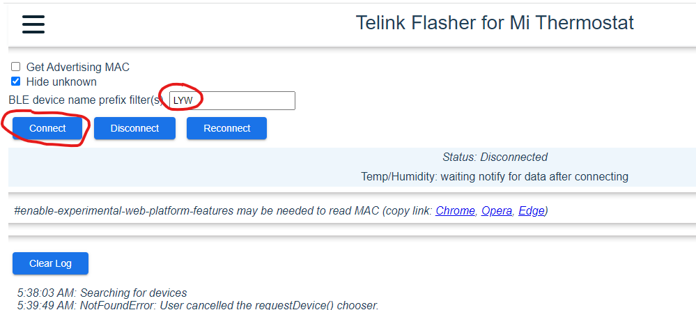
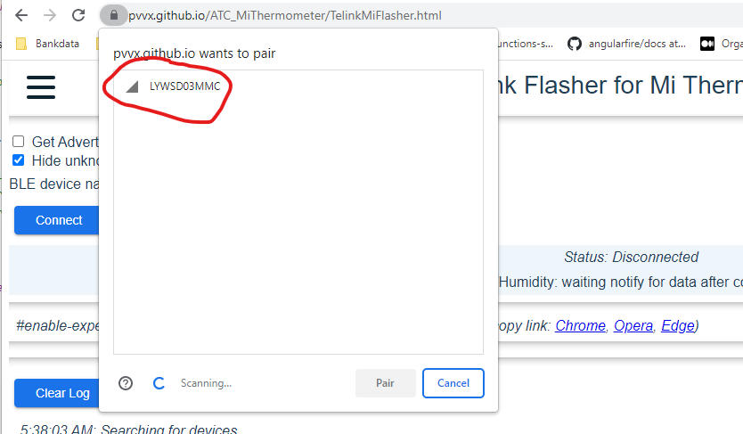
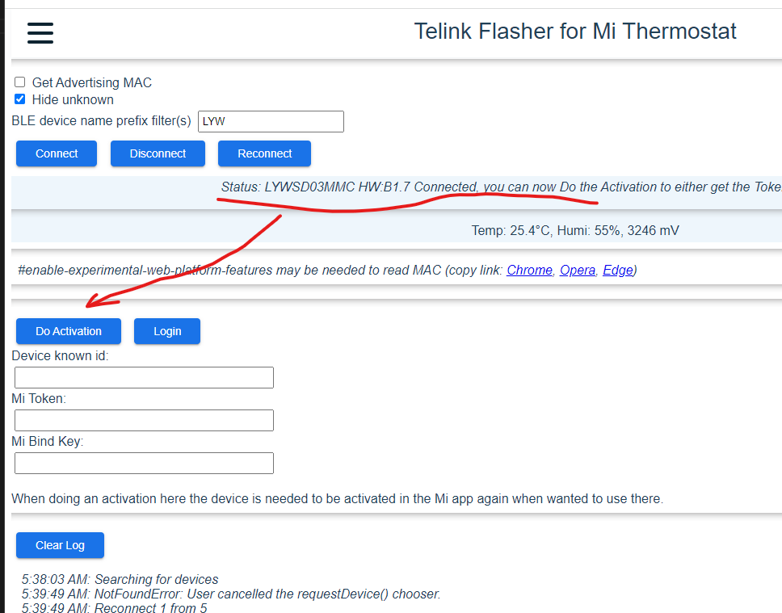
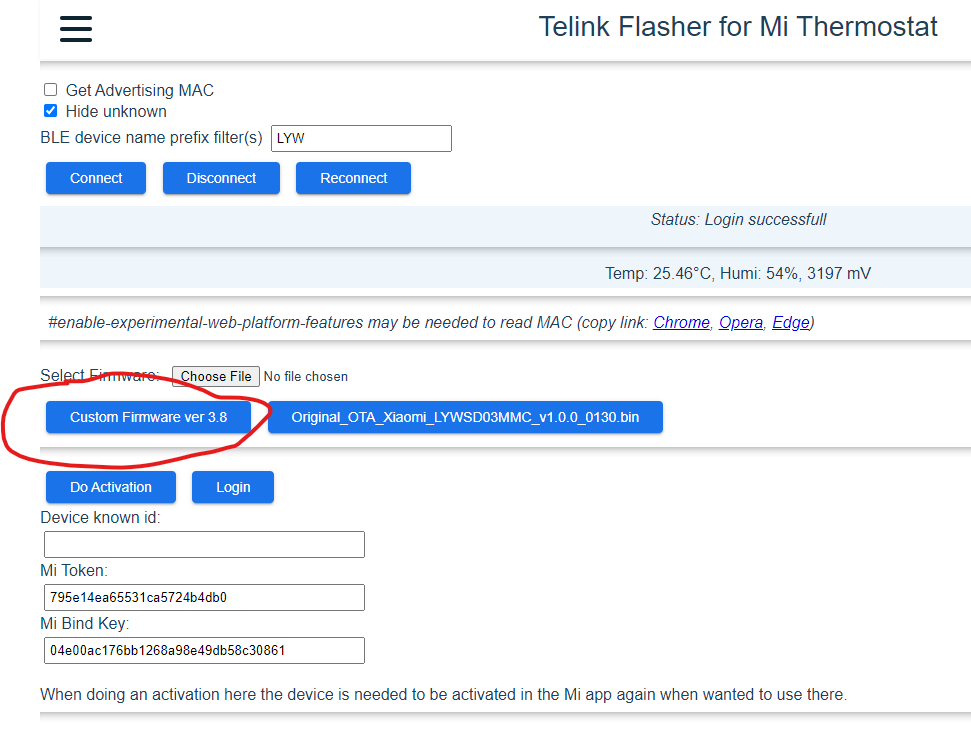
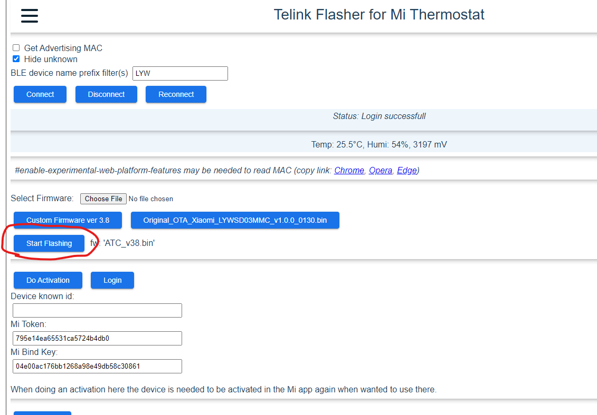

# Simple setup guide

Setting up the "Xiaomi Mi Temperature and Humidity Monitor 2" to report data to SmartHeating servers involves 2 steps:

- Setup ESP32
- Upload custom firmware to sensors

## Setup ESP32
In the future a complete Wifi Manager will be integrated but until that is completed WIFI settings must be edited in the code (we are developers ;-) ) 

1. Open lib\esp32_mqtt\ciotc_config.h
2. Look for *ssid and *password and change it
3. Upload project with PlatformIO

## Upload custom firmware Xiaomi temperature sensor
For better perfomance/stability the sensors must be flashed. 

Open [Telink Flasher for MI Thermostat](https://pvvx.github.io/ATC_MiThermometer/TelinkMiFlasher.html) and follow the steps below:

### ___1. Connect to the device (use filter)___

### ___2. Activate___

### ___3. Upload new firmware___

